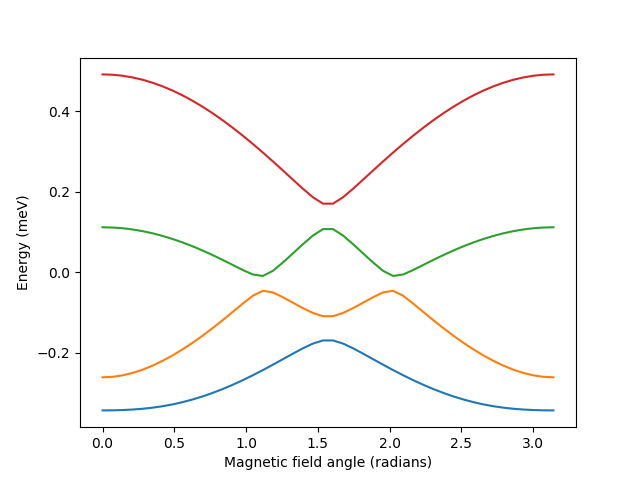

Carbon nanotube spectrum
========================

Calculates carbon nanotube spectrum and excitation spectrum using the Hamiltonian in equation (25) in

E. Laird et al., Reviews of Modern Physics, 87, 703 (2015)

All energy values are in milli-electronvolts.


## Example
This piece of code from simple_example.py
````python
from cntspectrum import cntSpectrum
import numpy as np
import matplotlib.pyplot as plt
model_kw = {
    'deltaSO': 0.15,
    'deltaKK': 0.07,
    'mu_orb': 0.15,
    'J': 0.12,
}
model = cntSpectrum(**model_kw)
B_fields = 2
B_angles = np.linspace(0, np.pi, 46)
filling = 1
spectrums = model.get_spectrums(B_fields, B_angles, filling)
fig, ax = plt.subplots()
ax.plot(B_angles, spectrums.squeeze())
ax.set_xlabel('Magnetic field angle (radians)')
ax.set_ylabel('Energy (meV)')
plt.show()
````
yields the figure




## Citation
1. E. Laird et al., Reviews of Modern Physics, 87, 703 (2015)
2. D. H. Douglass, Phys Rev Lett, 6, 7 (1961)


## Help
Type `help(cntSpectrum)`


## Credit and Copyright
Morten Canth Hels
